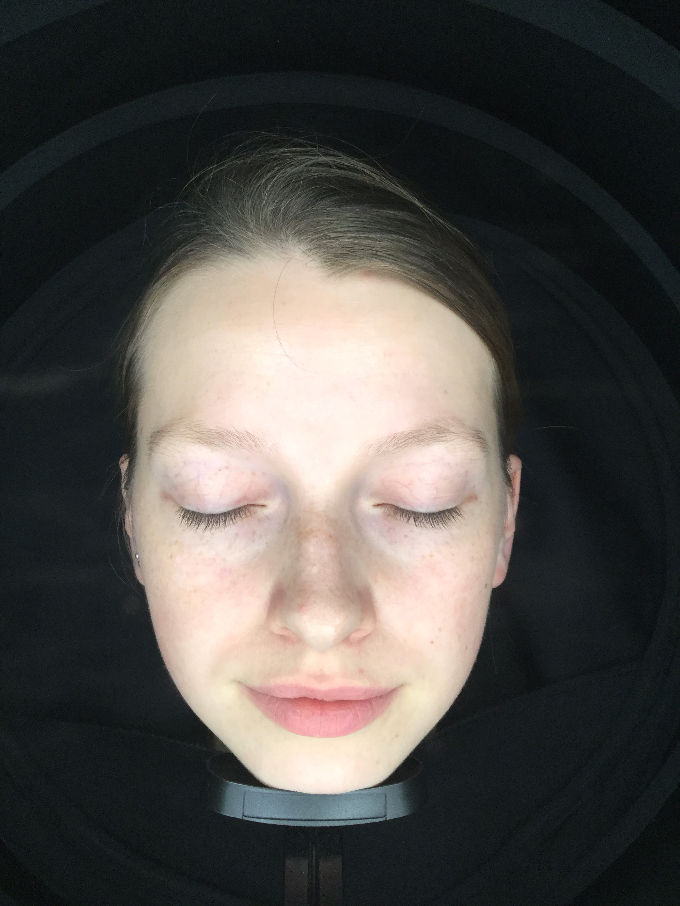
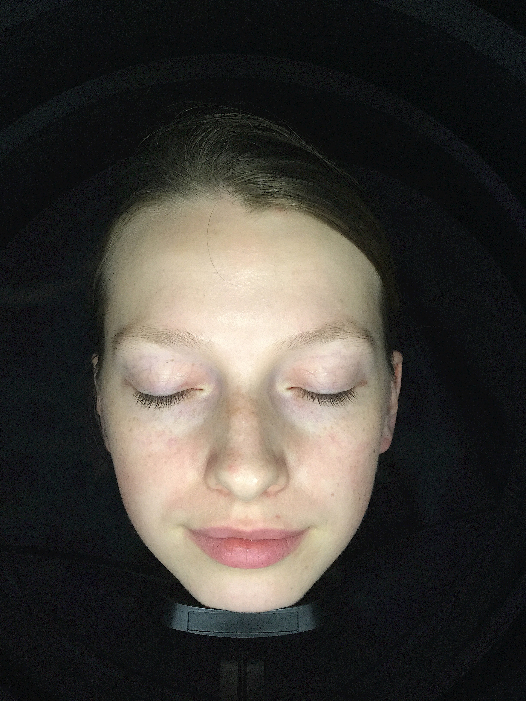
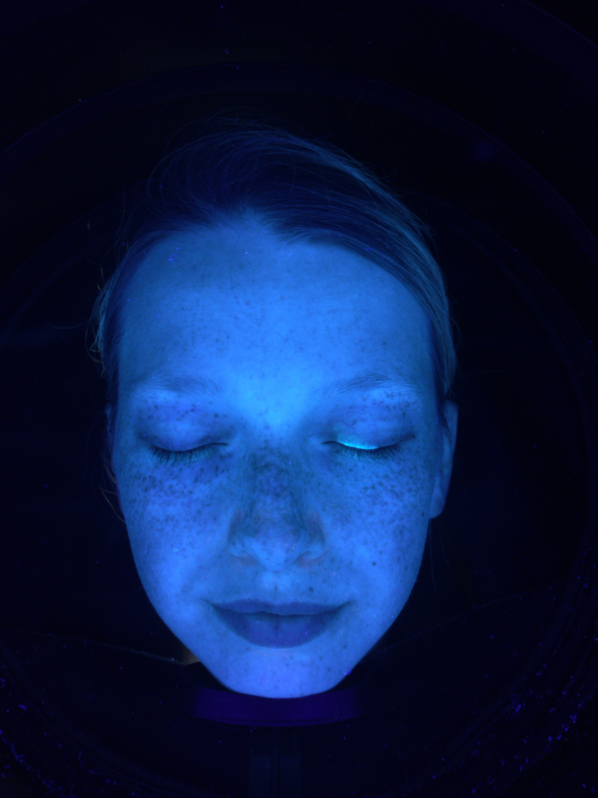
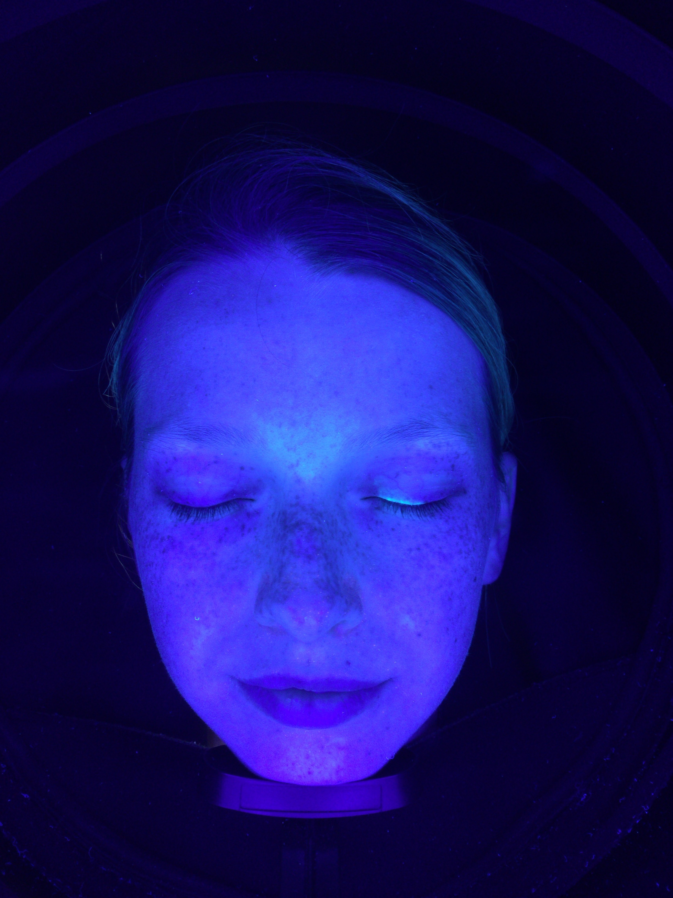
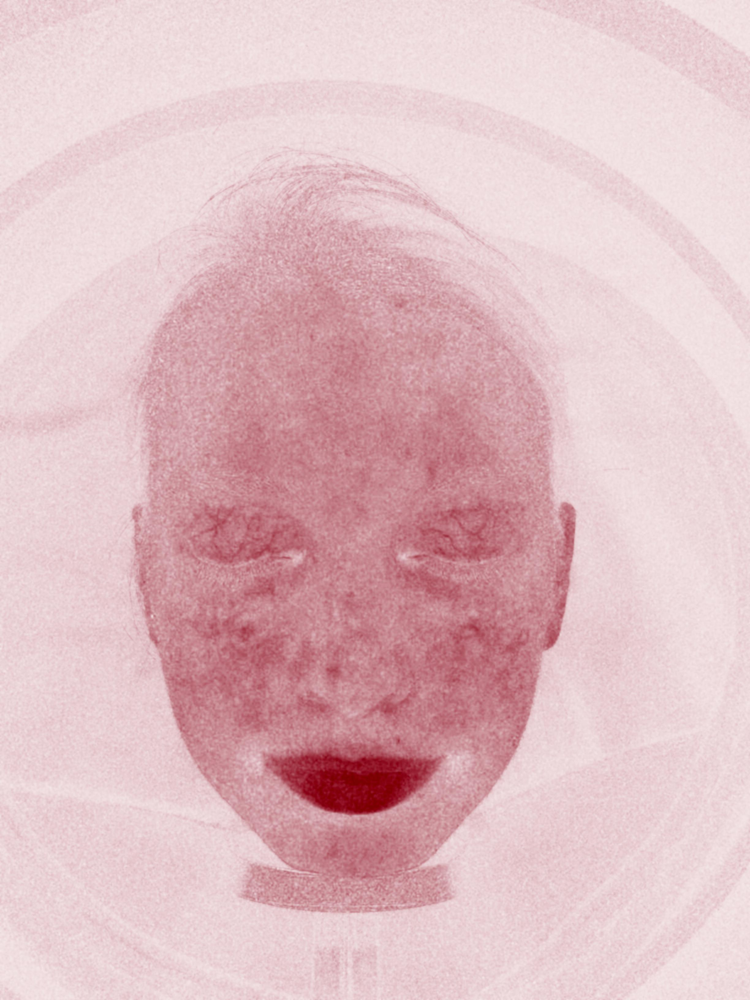
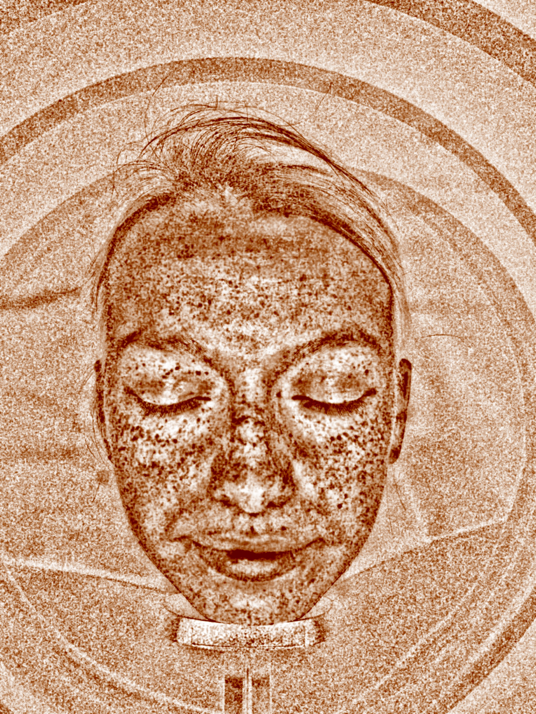
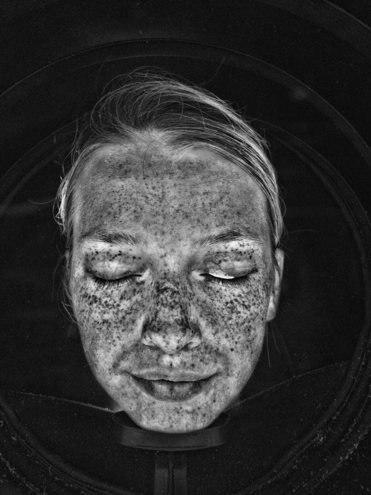
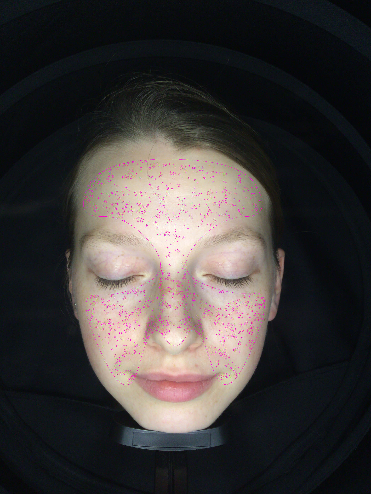

# AI智能图样例

## 图样示例

##### 1、日光图

从各个方向向面部照射柔和的散射光线,均匀照亮面部的所有细节,不会产生阴影,也不会突出皮肤不同层面的特殊问题。为综合评价面部皮肤提供客观和直观的影像基础。 

##### 2、极化图

我们通常因皮肤表面的较强直接反射光而无法清晰地观察皮肤表皮下方。在极化模式中采用用特殊的极化镜组,可有效地减弱直接反射光,使得我们能够观察到表皮下方的肤色不均和亮泽皮肤下隐藏的微血管结构。在极化模式下,老化的皮肤可能更透明显露出皮肤表皮下方的不规则的皮肤特征。

##### 3.纹理图

通过独特拍摄光线,可加强皮肤表面纹理的可见性。此拍摄模式与极化图的拍摄模式正相反,在这种模式下,拍摄镜组降低皮肤表层下方的隐藏的皮肤特征的可见性,加强表面光学反射,展示表面纹理细节、毛孔结构和初现的细纹

##### 4、UV图

在特定光线下, 可向面部皮肤照射少量无害紫外光线，这些不可见光线可穿透肌肤表层。在皮肤表面下方,细胞和组织具有将这些不可见光线转化成可见荧光的天然功能,从而有效地让皮肤变成发光体。因为光线产自皮肤内,而不是通常的反射光,这样就可以清晰观察到皮肤表面下隐藏的皮肤问题。

##### 5、伍氏图

借助拍摄灯光谱线可看到活性皮脂腺和油膜分布,同时可观察到皮脂腺周围的发炎活动的强度和深度,尤其适合辨识黄褐斑

##### 6、老化图

皮肤由于生理老化和光损伤会导致出现肤色不均的现象,不同于出生时先天的均匀肤色,面部各区域会出现局部色素沉积肤色也会发生变化。生理老化图重点反映肤色和色素沉着中的细微差别,从而使得肤色不均匀对年龄的影响比皱纹、肌肤下垂等表面老化迹象更好识别。

##### 7、敏感图

健康肌肤为粉白色,由于炎症、长痘、挤压、等原因导致皮肤底层出现局部点状红色症状,需要通过治疗改善;日光照射、过敏、运动后的血液循环等原因导致的全脸大面积红则随着时间和循环减慢会自动消失;两种情况出现的反应完全不同。

##### 8、棕色图

棕色图,可以清楚的看到黑色素分布情况通过黑色素分析可分析到斑的类型(黄褐斑、褐青色痣、老年斑等)，皮肤底层有没有隐藏的色素有没有做过斑的治疗, 是什么样的治疗(产品换肤,光类治疗等)。

##### 9、趋势图

设备根据皮肤基础状态,结合前几种模式面部分析数据, DJM云端计算机能够精准的计算出面部未来斑的分布和状态,更早一步的了解斑的发展趋势。

##### 10、黑白图

黑白图,可以清晰的看到客户面部日晒型色斑趋势;光老化趋势;及毛孔垃圾分布,可根据检测结果做对应皮肤问题的预防措施。

##### 11、AI诊断图

##### 12、毛孔图

##### 13、斑点图

##### 14、皱纹图

##### 15、黑白图

##### 16、黑头图

