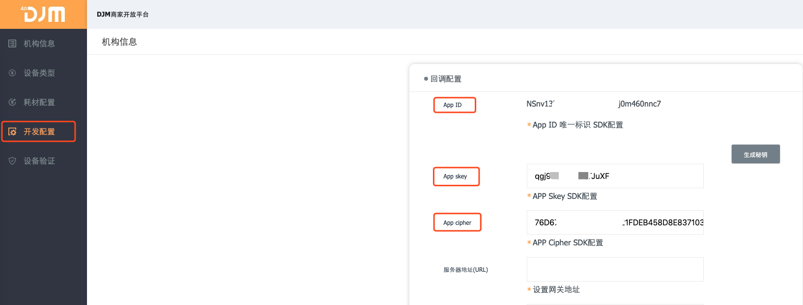

# SDK配置说明

## 商户后台开发者配置

##### 商户开发者平台入口[URL](http://djm.hoyar.com.cn/orgLogin/login)

- 登录相关机构账号
- 点击生成秘钥(如下图所示)

 


## Xcode SDK 配置 


 在上面步骤拿到 APPKey 后，App  需要首次调用 SDK时，需要进行参数化，建议 在App启动时进行：


```objective-c

#import "MoreMeCammer.h"


- (BOOL)application:(UIApplication *)application didFinishLaunchingWithOptions:(NSDictionary *)launchOptions {

    // Override point for customization after application launch.*
    [MoreMeCammer startWithAppId:@"NS6o9arh3o0l4h89d9nwn88p9c3202m5"     skey:@"yJ5SmJz119lvhv2n" cipher:@"6104A94E2E3041E62A3D0EB18AC5ADDAE8A83CA2FE3B7AEB649BAF75350D9ADD"];
    return  YES;

}
```


## Token获取

| appid  | string | App Id 来自物联网机构管理后台->开发配置 |
| ------ | ------ | --------------------------------------- |
| skey   | string | Skey 来自物联网机构管理后台->开发配置   |
| cipher | string | Cipher 来自物联网机构管理后台->开发配置 |


