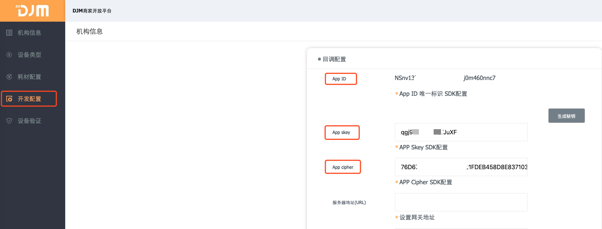

## 01.授权配置

## 商户后台开发者配置

##### 商户开发者平台入口[URL](http://djm.hoyar.com.cn/orgLogin/login)

- 登录相关机构账号
- 点击生成秘钥(如下图所示)

 

## 开发文档阅读顺序说明

### 1.SDK对接方式

- ~~SDK1.0协同~~

- SDK2.0协同

- Web数据协同

  - 回调接口配置
  - 回调接口调用说明

  

### 2.App唤起模式

- App唤起模式
- Web数据协同
  - 回调接口配置
  - 回调接口调用说明